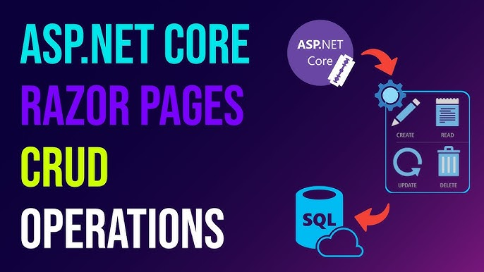

# ASP.NET Core Razor Pages CRUD App 🌐🗃️

A web application built with ASP.NET Core Razor Pages that implements full **CRUD** (Create, Read, Update, Delete) operations for user management, using an in-memory data store and the MVC architectural pattern.

<div align="center">
  
</div>

<br>
<div align="center">
  <a href="https://codeload.github.com/TendoPain18/aspnet-razor-pages-crud/legacy.zip/main">
    
  </a>
</div>

## 📋 Description

This project demonstrates a complete data management web application using ASP.NET Core Razor Pages. It manages a list of users stored in an in-memory singleton (`FakeDB`), providing a clean interface for all standard CRUD operations without requiring a database setup.

## ✨ Features

- **Create**: Add new users via a form with first name, last name, email, and gender
- **Read**: View detailed information for any individual user
- **Update**: Edit existing user records with pre-filled form fields
- **Delete**: Remove users with a confirmation page
- **User Listing**: Home page displays all users in a table with action links
- **Navigation**: Navbar with quick access to the Create page from anywhere

## 🛠️ Built With

- **Framework**: ASP.NET Core Razor Pages (.NET)
- **Language**: C#
- **Frontend**: Bootstrap 5, HTML, CSS
- **Data Store**: In-memory `FakeDB` singleton (no external database required)
- **IDE**: Visual Studio

## 🚀 Getting Started

### Prerequisites

- [.NET SDK](https://dotnet.microsoft.com/download) (6.0 or later)
- Visual Studio 2022 (or any IDE with .NET support)

### Installation

1. **Clone the repository**
```bash
git clone https://github.com/TendoPain18/aspnet-razor-pages-crud.git
```

2. **Open the solution**
```
WebApplication1.sln
```

3. **Run the application**
   - Press `F5` in Visual Studio, or run:
```bash
dotnet run
```

4. **Open in browser**
```
https://localhost:7232
```

## 📖 Usage

### User Management

- **Home page** (`/Index`): Lists all users with Read, Update, and Delete links per row
- **Create** (`/userPages/Create`): Fill in the form and click **Add** to create a new user
- **Read** (`/userPages/Read?id={id}`): View full details for a specific user
- **Update** (`/userPages/Update?id={id}`): Edit user fields and click **Update** to save changes
- **Delete** (`/userPages/Delete?id={id}`): Confirm deletion of a user

### Data Model

Each user record contains:

| Field | Type | Description |
|-------|------|-------------|
| ID | int | Auto-incremented unique identifier |
| Fname | string | First name |
| Lname | string | Last name |
| Email | string | Email address |
| Gender | string | Male / Female |

## 🎓 Learning Outcomes

This project demonstrates ASP.NET Core Razor Pages, page model binding with `[BindProperty]`, dependency injection with singleton services, and routing with query parameters.

## 🙏 Acknowledgments

- Course: Web Development — ASP.NET Core
- Microsoft ASP.NET Core documentation

<br>
<div align="center">
  <a href="https://codeload.github.com/TendoPain18/aspnet-razor-pages-crud/legacy.zip/main">
    
  </a>
</div>

## <!-- CONTACT -->
<div id="toc" align="center">
  <ul style="list-style: none">
    <summary>
      <h2 align="center">
        🚀
        CONTACT ME
        🚀
      </h2>
    </summary>
  </ul>
</div>
<table align="center" style="width: 100%; max-width: 600px;">
<tr>
  <td style="width: 20%; text-align: center;">
    <a href="https://www.linkedin.com/in/amr-ashraf-86457134a/" target="_blank">
      
    </a>
  </td>
  <td style="width: 20%; text-align: center;">
    <a href="https://github.com/TendoPain18" target="_blank">
      
    </a>
  </td>
  <td style="width: 20%; text-align: center;">
    <a href="mailto:amrgadalla01@gmail.com">
      
    </a>
  </td>
  <td style="width: 20%; text-align: center;">
    <a href="https://www.facebook.com/amr.ashraf.7311/" target="_blank">
      
    </a>
  </td>
  <td style="width: 20%; text-align: center;">
    <a href="https://wa.me/201019702121" target="_blank">
      
    </a>
  </td>
</tr>
</table>
<!-- END CONTACT -->
